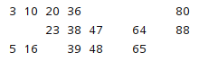

# Ejercicio juego Bingo 90 bolas

Vamos a añadir a nuestro programa de juegos, el juego del Bingo. Con lo cual, tendremos disponible para jugar: 
MultiplicationGame, Ahorcado y ahora Bingo.
Todos ellos para dos jugadores.

## El juego
El bingo es un juego de azar que consiste en un bombo con un número determinado de bolas numeradas en su interior
(para este caso, 90 bolas). 

Los jugadores juegan con cartones con números aleatorios escritos en ellos, dentro del rango correspondiente. 

Un locutor va sacando bolas del bombo, anunciando los números en voz alta. Si un jugador tiene dicho número en su cartón lo tacha, y el juego continúa así hasta que alguien consigue marcar todos los números de su cartón.

## Cartón de juego
El cartón o tarjeta que compra el jugador cuenta con 15 números distintos y distribuidos en tres líneas horizontales de cinco números cada una y en nueve columnas verticales, distribuidos sobre una base de 90 números consecutivos.

Ejemplo:

## El programa

Construir el juego del bingo en Java, adaptado de la siguiente manera:

1. Es necesario indicar cuantos jugadores habrá. 
2. Pedirá los nombres de los jugadores, su ciudad y su edad, para comprobar que son mayores de edad todos.
3. El juego generará cartones aleatorios para todos los jugadores y mostrará por pantalla el cartón de cada jugador.
4. Preguntará si estamos listos para empezar.
5. Cuando aceptemos, el juego empezará a dar números aleatorios dentro del rango.
6. El mismo programa validará cada número extraído aleatoriamente en todos los cartones de los jugadores.
7. Si lo encuentra en algún carton, informará de ello, indicando el jugador. Si no lo encuentra, no hace nada. 
8. Seguirá extrayendo números de esta manera hasta que un carton haya sido completado.
9. Cuando un carton se complete, informará de que jugador ha ganado. Mostrará su información personal y su cartón.
10. Para terminar mostrará como han quedado los cartones del resto de jugadores.

## El programa mejorado
1. Cada 10 números generados aleatoriamente por la máquina, el programa preguntará si deseamos seguir jugando. En caso 
   de no querer hacerlo, el estado del juego debe guardarse. 
2. Por lo tanto, al iniciar el juego, también debemos poder recuperar partidas guardadas.
3. Se pueden llegar a guardar hasta 10 partidas diferentes.
4. Por lo tanto, habremos de gestionar de alguna manera el poder recuperar una partida u otra al iniciar. 
5. Toda partida recuperada y terminada, debería borrarse.

Sugerencia de pasos por los que empezar:
0. Planificación antes de cada paso e imaginar el resultado lógico, para diseñar escenarios reales.
1. Crear una aplicación que genere cartones de bingo 
2. Añadir a la aplicación anterior la gestión de usuarios
3. Añadir el resto del juego Bingo.
4. Añadir gestión de guardado de partidas.
