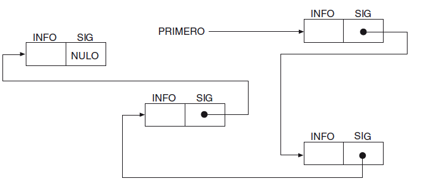
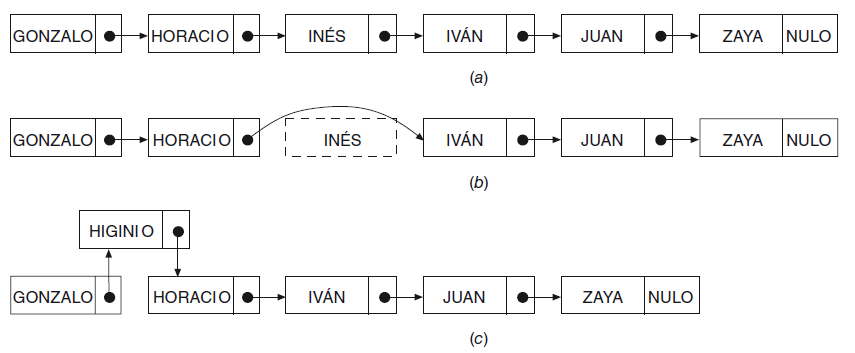
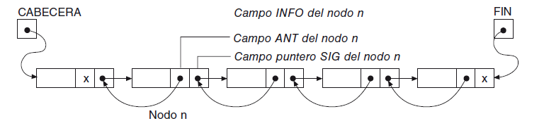
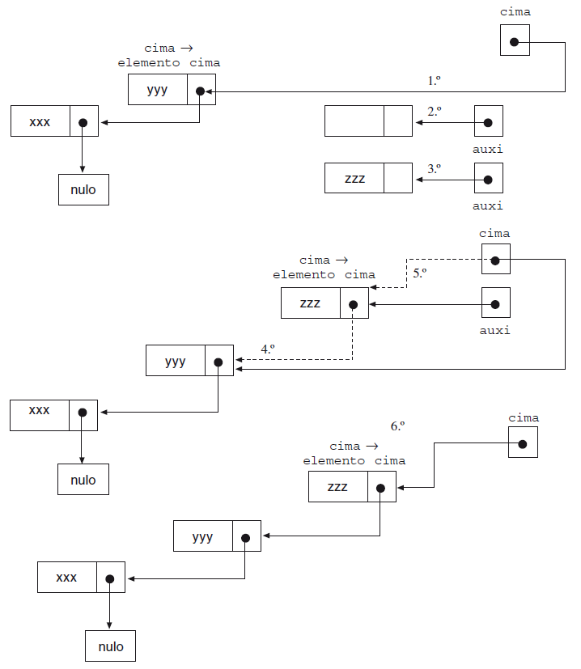
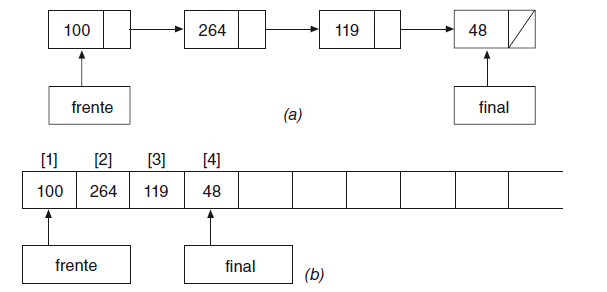
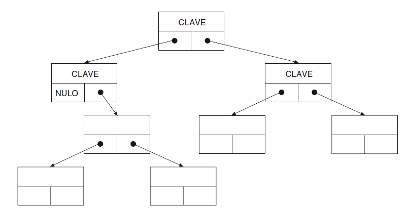
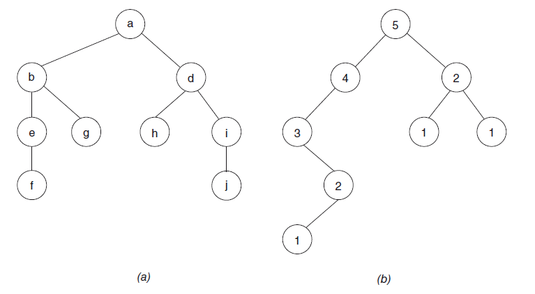
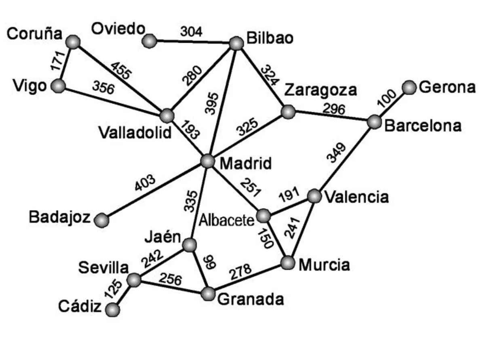
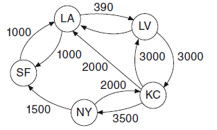

# ESTRUCTURAS DE DATOS

Para ver esta información de forma más amena podéis acceder a [AULA EN LA NUBE](https://www.youtube.com/watch?v=4Wqiackpdgk&list=PLG1qdjD__qH6ULjW5iN8E45m5nkaCNbUu&index=143)

##  ¿Qué son las estructuras de datos?

Las estructuras de datos en programación son un modo de representar información en una computadora. Conocerlas 
en profundidad permite organizar mejor la información y diseñar la solución al un problema con la opción de código más 
eficiente.

En las unidades didácticas iniciales introdujimos el concepto de datos de tipo simple que representan valores de 
tipo simple: número entero, real, carácter... Sin embargo, en muchas ocasiones necesitamos procesar conjuntos de 
datos relacionados entre sí, como puede ser un grupo de alumnos, alimentos en un almacén... para las cuales 
trabajamos con Arrays y Listas.

Los tipos de __datos simples o primitivos__, como su propio nombre indica, no están compuestos de otras estructuras de 
datos. Por contra, los tipos de __datos compuestos__ están construidos basándose en tipos de datos primitivos; el 
ejemplo más representativo es la cadena (string) de caracteres.

Los tipos de datos simples pueden ser organizados en diferentes estructuras de datos: estáticas y dinámicas.

Las estructuras de datos __estáticas__ son aquellas en las que el tamaño ocupado en memoria se define antes de que el 
programa se ejecute y no puede modificarse dicho tamaño durante la ejecución del programa. Como ejemplo de este tipo,
encontramos los propios datos primitivos y los arrays.

Las estructuras de datos __dinámicas__ son aquellas en las que el tamaño ocupado en memoria se define durante la 
ejecución del programa y puede modificarse en función de las necesidades del programa, evitando las limitaciones o 
restricciones en el tamaño de memoria ocupada que son propias de las estructuras estáticas. Como ejemplo de este tipo, encontramos las listas 
enlazadas, pilas, colas, árboles y grafos.

## Estructuras de datos dinámicas

Una estructura de datos dinámica es una colección de elementos denominados nodos de la estructura que son enlazados juntos.
Mediante un tipo de dato específico, denominado puntero, es posible ir enlazando los nodos de la estructura de datos, 

Las estructuras de datos dinámicas son soportadas por la mayoría de los lenguajes de programación, ya que ofrecen 
soluciones eficaces y efectivas en la solución de problemas complejos. 

Se clasifican en lineales y no lineales. 

## Estructuras de datos: dinámicas y lineales

LINEAL: A cada elemento le corresponde siempre un “siguiente” elemento.

### LISTA

Nos encontramos ante dos tipos de listas: las listas lineales y las listas lineales enlazadas.

#### __Lista lineal__ 

Formada por un conjunto de elementos de un mismo tipo, que pueden variar en número y, donde 
cada elemento tiene un único predecesor y un único sucesor, excepto el primero y último de la lista. 
Los elementos de una lista lineal se almacenan normalmente contiguos en posiciones consecutivas de la memoria.

#### __Lista enlazada__ 

Formada por un conjunto de elementos en los que cada elemento contiene la posición (o dirección) del 
siguiente elemento de la lista. Cada elemento de la lista enlazada debe tener al menos dos campos:
un campo que tiene el valor del elemento y un campo (enlace, link) que contiene la posición del siguiente elemento.

Elementos no adyacentes de una lista enlazada:

Inserción y borrado de elementos:

En las listas lineales anteriores el recorrido de los elementos de las mismas, solo puede 
hacerse en un único sentido: de izquierda a derecha (principio a final), pero en numerosas ocasiones se necesita 
recorrer las listas en ambas direcciones.
Las listas que pueden recorrerse en ambas direcciones se denominan __listas doblemente enlazadas__. En estas listas
cada nodo consta del campo de datos y dos campos de enlace o punteros: ANTERIOR(ANT) y SIGUIENTE(SIG), por lo que 
este tipo de lista ocupa más espacio en memoria que las anteriores para una misma cantidad de información.

### PILA

Una pila (stack) es un tipo especial de lista lineal en la que la inserción y borrado de nuevos elementos se realiza
solo por un extremo que se denomina cima o tope (top).

La pila es una estructura con numerosas analogías en la vida real: una pila de platos, una pila de monedas, una
pila de cajas de zapatos, una pila de camisas, una pila de bandejas, etc.

Dado que las operaciones de insertar y eliminar se realizan por un solo extremo (el superior), los elementos solo
pueden eliminarse en orden inverso al que se insertan en la pila. El último elemento que se pone en la pila es el
primero que se puede sacar; por ello, a estas estructuras se les conoce por el nombre de LIFO (last-in, first-out, último
en entrar, primero en salir).

Añadir elementos a la pila (__apilar__):

### COLA

Las colas son similares a las pilas, diferenciándose de ellas en el modo de insertar/eliminar elementos.
Una cola (queue) es una estructura lineal de datos en la que las eliminaciones se realizan al principio de la lista,
y las inserciones se realizan en el otro extremo. 

En las colas el elemento que entró el primero sale también el primero; por ello se conoce como listas FIFO (first-in,
first-out, “primero en entrar, primero en salir”). Así, pues, la diferencia con las pilas reside en
el modo de entrada/salida de datos; en las colas las inserciones se realizan al final de la lista, no al principio. Por ello
las colas se usan para almacenar datos que necesitan ser procesados según el orden de llegada.

Representación de una cola: (a) mediante una lista enlazada; (b) mediante un array.

## Estructuras de datos: dinámicas y no lineales

NO LINEAL: Cada elemento puede tener diferentes “siguientes” elementos, introduciendo el concepto de estructuras de 
bifurcación.

### ÁRBOL

Estructura de datos fundamental porque se adapta a la representación natural de informaciones homogéneas organizadas.
Las estructuras tipo árbol se usan principalmente para representar datos con una relación jerárquica entre sus
elementos, como son árboles genealógicos, tablas, etc.

Los árboles están formados por:
- Un único nodo __raíz__, que no es hijo de ningún elemento. 
- Todos los nodos no raíz, que además tienen un solo padre. 
- Nodos que no tienen hijos y se denominan __hojas__.

Existe un tipo de árbol denominado __árbol binario__ que puede ser implementado fácilmente en una computadora.

Un árbol binario es un conjunto finito de cero o más nodos, tales que:
- Existe un nodo denominado raíz del árbol.
- Cada nodo puede tener 0, 1 o 2 subárboles, conocidos como subárbol izquierdo y subárbol derecho.

Representación de un árbol binario con punteros:

Un árbol binario se llama __completo__ si todos sus nodos tienen exactamente dos subárboles, excepto los nodos de los
niveles más bajos que tienen cero. Por contra, se denomina __árbol degenerado__ a un árbol en el que todos sus nodos 
tienen solamente un subárbol, excepto el último.
El procesamiento de árboles binarios completos (equilibrados) es más sencillo que los árboles no equilibrados.

Representación de un árbol binario: (a) equilibrado, (b) no equilibrado:

### GRAFO

Los árboles binarios representan estructuras jerárquicas con limitaciones de dos subárboles por cada nodo. Si se
eliminan las restricciones de que cada nodo puede apuntar a dos nodos —como máximo— y que cada nodo puede
estar apuntado por otro nodo —como máximo— nos encontramos con un grafo.

Ejemplos de grafos en la vida real los tenemos en la red de carreteras de un estado o región, la red de enlaces
ferroviarios o aéreos nacionales, etc. En una red de carreteras los nudos de la red representan los vértices del 
grafo y las carreteras de unión de dos ciudades los arcos, de modo que a cada arco se asocia una información tal 
como la distancia, el consumo en gasolina por automóvil, etc.

Pueden ser:

- __Dirigidos__, cuando los vértices apuntan unos a otros; los arcos están dirigidos o tienen dirección.
- __No-dirigidos__, cuando los vértices están relacionados, pero no se apuntan unos a otros; la dirección no es 
  importante.
- __Ponderado__, cuando cada arista o arco tiene un valor. Los grafos con peso suelen
ser muy importantes, ya que pueden representar situaciones de gran interés; por ejemplo, los vértices pueden ser
ciudades y las aristas distancias o precios del pasaje de ferrocarril o avión entre ambas ciudades. Eso nos puede permitir
calcular cuál es el recorrido más económico entre dos ciudades, sumando los importes de los billetes de las
ciudades existentes en el camino y así poder tomar una decisión acertada respecto al viaje e incluso estudiar el posible
cambio de medio de transporte: avión o automóvil, si estos resultan más baratos.

Grafo ponderado:

Grafo ponderado y dirigido:

## TABLA HASH

Una tabla hash, también conocida como mapa hash, es un tipo de estructura que 'mapea' claves con
valores. En este tipo de estructura el orden físico de los elementos no se corresponde con el orden lógico esperado. Para 
cada elemento se calcula una clave (key), que se relaciona con el propio elemento (valor) y se 
almacena en función del orden dado por la clave.

Esta organización tiene la ventaja de que se pueden leer y escribir registros en cualquier orden y posición. Son
muy rápidos de acceso a la información que contienen. También tienen el inconveniente de que es necesario programar la 
relación existente entre el contenido de un elemento y la posición que ocupa. Para ello, la tabla hash utiliza 
una función hash para calcular un índice en un array de 'cubos' o ranuras, desde el cual se puede encontrar el valor 
deseado.

Idealmente, la función hash asignará cada clave a una ranura única. Sin embargo, en la mayoría de los casos, es 
posible que dos claves diferentes puedan producir el mismo índice. Esto se conoce como una colisión. Hay varias 
técnicas para manejar las colisiones, en las cuales no entraremos en detalle.

**Nota**:
Información e imágenes extraídos del libro Fundamentos de la Programación de Luis Joyanes Aguilar y Matilde 
Fernández Azuela.
