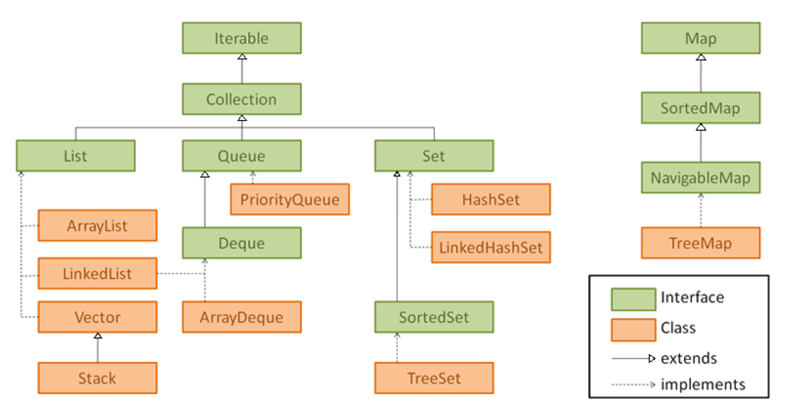

# Interfaz ITERABLE

<!-- TOC -->
* [Interfaz ITERABLE](#interfaz-iterable)
  * [¿Qué es la interfaz Iterable?](#qué-es-la-interfaz-iterable)
  * [Jerarquía de clases de las colecciones en Java](#jerarquía-de-clases-de-las-colecciones-en-java)
  * [¿Cómo funciona Iterable en Java?](#cómo-funciona-iterable-en-java)
  * [Implementando la interfaz Iterable en una clase personalizada](#implementando-la-interfaz-iterable-en-una-clase-personalizada)
  * [Comparación entre Iterable, foreach y bucle for](#comparación-entre-iterable-foreach-y-bucle-for)
<!-- TOC -->

Para ver esta información de forma más amena podéis acceder a [AULA EN LA NUBE](https://www.youtube.com/watch?v=zBE4fx9QyoY&list=PLG1qdjD__qH6ULjW5iN8E45m5nkaCNbUu&index=144&t=459s)


## ¿Qué es la interfaz Iterable?

La interfaz `Iterable` proporciona un mecanismo estándar para permitir la iteración sobre una colección de elementos 
formando una parte fundamental del framework de colecciones en Java. 

En concreto es una interfaz genérica que contiene un único método, `iterator()`, que devuelve un iterador sobre los elementos de un conjunto.

[Ir a Oracle](https://docs.oracle.com/en/java/javase/17/docs/api/java.base/java/lang/Iterable.html)

Se puede utilizar cuando necesitamos recorrer una colección de objetos de manera secuencial y sin necesidad de acceder 
a elementos específicos por índice.

## Jerarquía de clases de las colecciones en Java

En Java, las colecciones están organizadas en una jerarquía de clases. La clase principal en esta jerarquía es la interfaz `Collection`, que define el comportamiento general de una colección de objetos. A su vez, existen varias interfaces e implementaciones concretas de colecciones que heredan de `Collection`.

- **Interfaz Collection**: Define las operaciones básicas comunes a todas las colecciones, como añadir, eliminar y comprobar la existencia de elementos.

    - **List**: Colección ordenada que permite duplicados.
    - **Set**: Colección que no permite duplicados y no garantiza un orden específico.
    - **Queue**: Colección diseñada para almacenar elementos antes de procesarlos.
    - **Deque**: Colección que permite operaciones en ambos extremos de la cola.
 
Todas estas colecciones implementan a su vez, la interfaz Iterable:



## ¿Cómo funciona Iterable en Java?

Para hacer uso de ella, crearemos un iterador que obtendremos a partir del método iterator() y a continuación,  
haremos uso de él a partir de los dos métodos clave que nos proporciona: hasNext() y next().

Vamos a ver un ejemplo de uso:

```java
List<String> personas = new ArrayList<>();
personas.add("Pedro");
personas.add("David");
personas.add("Miguel");
personas.add("Antonio");
personas.add("Pedro");

Iterator<String> iterador = personas.iterator();
while (iterador.hasNext()) {
    System.out.println(iterador.next());
}
```

## Implementando la interfaz Iterable en una clase personalizada

```java
public class MiColeccion<T> implements Iterable<T> {
    private List<T> elementos = new ArrayList<>();

    public void agregar(T elemento) {
        elementos.add(elemento);
    }

    @Override
    public Iterator<T> iterator() {
        return elementos.iterator();
    }
}
```

No es la intención de este tema detallar más allá el comportamiento de esta interfaz, pero es posible llegar a mayor 
detalle. Para quien quiera ir un poco más allá os animo a ver el siguiente video de [AULA EN LA NUBE](https://www.youtube.com/watch?v=rpFq5O9XIAg&list=PLG1qdjD__qH6ULjW5iN8E45m5nkaCNbUu&index=145)

## Iterable usado en un for

```java
List<String> personas = new ArrayList<>(); 
for (Iterator<String> it = personas.iterator() ; it.hasNext() ; ) {
        // Ejecuto acción
        it.next();
 }
```

## Comparación entre Iterable, foreach y bucle for

La interfaz `Iterable` en Java ofrece una forma elegante y eficiente de recorrer colecciones de manera secuencial.
Internamente, el bucle foreach invoca el método `iterator()` de la clase para obtener un iterador y luego utiliza este iterador para recorrer los elementos.

- **Iterable**:
    - Ventajas: Es más simple y conciso que un bucle for tradicional. Adecuado para recorrer colecciones de manera 
      secuencial. Permite modificar la colección mientras se itera.
    - Desventajas: No permite acceder a elementos por índice.

- **Foreach**:
    - Ventajas: Sintaxis clara y legible. Automáticamente maneja la obtención de un iterador.
    - Desventajas: No es adecuado si se necesita acceder a elementos por índice o modificar la colección mientras se itera.

- **Bucle for**:
    - Ventajas: Permite acceder a elementos por índice y modificar la colección mientras se itera.
    - Desventajas: Sintaxis más compleja y propensa a errores.
