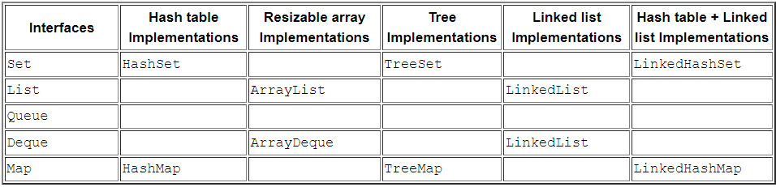

# Introducción a las Colecciones en Java

Para ver esta información de forma más amena podéis acceder a [AULA EN LA NUBE](https://www.youtube.com/watch?v=1kXIFVYVp48&list=PLG1qdjD__qH6ULjW5iN8E45m5nkaCNbUu&index=150&t=95s)

Las colecciones en Java son estructuras de datos que permiten almacenar, manipular y acceder a grupos de objetos de 
manera eficiente.  Estas estructuras son fundamentalmente interfaces y clases que forman parte del paquete `java.util`.

La interfaz `Collection` es la raíz de la jerarquía de las colecciones y define las operaciones básicas que 
todas las colecciones deben admitir, como agregar elementos, eliminar elementos, verificar la presencia de un 
elemento, entre otros.

[Ir a Oracle: API](https://docs.oracle.com/en/java/javase/17/docs/api/java.base/java/util/Collection.html)

**Ventajas de utilizar Colecciones en Java:**
- Facilitan la manipulación de datos de manera dinámica.
- Proporcionan métodos optimizados para agregar, eliminar y buscar elementos.
- Permiten el uso de algoritmos de procesamiento de datos de alto nivel.
- Son muy flexibles y pueden adaptarse a diferentes tipos de datos y necesidades.

## Breve resumen de que hace cada tipo de lista:

**1. Listas:**
  - Abstracción de una lista.
  - Permiten almacenar elementos en un orden específico.
  - Los elementos pueden duplicarse.
  - Implementaciones comunes: ArrayList, LinkedList.
  - Métodos importantes: add(), remove(), get(), size().

**2. Sets:**
  - Abstracción matemática de un conjunto
  - Almacenan elementos únicos, no permiten duplicados.
  - No garantizan un orden específico.
  - Implementaciones comunes: HashSet, TreeSet, LinkedHashSet.
  - La interfaz sortedSet (implica que el Set está ordenado y para ello requiere que los elementos tengan definido
      el método compareTo).
  - Métodos importantes: add(), remove(), contains(), size().

**3. Colas (Queues y Deque):**
 - Abstracción de una cola FIFO (First In First Out) o pila LIFO (Last In First Out).
 - Representan una colección de elementos ordenados en el que el principio de la cola (head) es el elemento menos 
   recientemente agregado y el final de la cola (tail) es el elemento más recientemente agregado.
 - Implementaciones comunes: LinkedList, PriorityQueue.
 - Métodos importantes: offer(), poll(), peek(), size().

**4. Mapas:**
  - Asocian claves únicas con valores.
  - No permiten claves duplicadas. Pero sí valores duplicados.
  - Implementaciones comunes: HashMap, TreeMap, LinkedHashMap
  - La interfaz sortedMap (implica que el Map está ordenado y para ello requiere que la clave tenga definido 
    el método compareTo).
  - Métodos importantes: put(), get(), remove(), containsKey().

A continuación se muestra una tabla extraída de los tutoriales de Oracle, que muestra de un vistazo, las 
implementaciones más apropiadas en función del propósito:

[Extraída de la web de Oracle](https://docs.oracle.com/javase%2Ftutorial%2F/collections/implementations/index.html)

