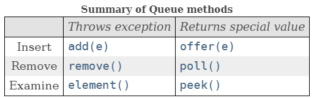

# INTERFAZ QUEUE

## ¿Qué es una cola?

[Ir a Oracle: Queue](https://docs.oracle.com/en/java/javase/17/docs/api/java.base/java/util/Queue.html)

Una cola (Queue) es una colección que representa una estructura FIFO (First-In, First-Out), donde el 
primer elemento que se añade es el primero en ser eliminado. 

La interfaz `Queue` proporciona métodos para agregar, eliminar y examinar elementos en la cola. Estos elementos 
pueden ser repetidos.

**Implementaciones comunes:**
- LinkedList: Implementación de cola basada en lista enlazada.
- PriorityQueue: Implementación de cola en la cual los elementos se ordenan según su prioridad.

**Métodos importantes:**



- `offer(E e)` vs `add(E e)`: Ambos métodos se utilizan para insertar un elemento en la cola. La diferencia 
  principal es su comportamiento cuando la cola está llena. 
  - `offer(E e)` insertará el elemento si es posible 
    hacerlo inmediatamente sin violar las restricciones de capacidad, devolviendo `true` si el elemento se agregó a 
    la cola y `false` si no se pudo agregar (por ejemplo, si la cola está llena). 
  - `add(E e)` intentará insertar el elemento, y si no puede hacerlo debido a restricciones de capacidad, lanzará una `IllegalStateException`.

- `remove()` vs `poll()`: Ambos métodos se utilizan para eliminar y devolver el elemento al frente de la cola. La 
  diferencia principal es su comportamiento cuando la cola está vacía. 
  - `remove()` lanzará una `NoSuchElementException` si la cola está vacía, mientras que 
  - `poll()` simplemente devolverá `null`.

- `element()` vs `peek()`: Ambos métodos se utilizan para recuperar, pero no eliminar, el elemento al frente de la 
  cola. La diferencia principal es su comportamiento cuando la cola está vacía.
  - `element()` lanzará una `NoSuchElementException` si la cola está vacía, mientras que 
  - `peek()` simplemente devolverá `null`.

**Ejemplo de uso:**
```java
import java.util.LinkedList;
import java.util.Queue;

public class Main {
    public static void main(String[] args) {
        Queue<Integer> cola = new LinkedList<>();

        cola.offer(1);
        cola.offer(2);
        cola.offer(3);

        System.out.println(cola.poll()); // Imprimirá 1
        System.out.println(cola.peek()); // Imprimirá 2
        System.out.println(cola.size()); // Imprimirá 2
    }
}
```

## Interfaz DEQUE

[Ir a Oracle: Deque](https://docs.oracle.com/en/java/javase/17/docs/api/java.base/java/util/Deque.html)

La interfaz `Deque` (Double Ended Queue) en Java representa una cola doble, lo que quiere decir que, puede utilizar 
como cola (primero en entrar, primero en salir/**FIFO**) o como pila (último en entrar, primero en salir/**LIFO**), 
admitiendo operaciones tanto en la parte delantera como en la trasera de la cola. 

Como la interfaz `Queue`, también permite elementos repetidos.

**Implementaciones comunes:**
- `LinkedList`.: Implementación de Deque basada en lista enlazada.
- `ArrayDeque`: Implementación de Deque que utiliza una matriz de tamaño variable para almacenar sus 
  elementos.

1. **`addFirst(E e)` / `offerFirst(E e)`:** Agrega un elemento al principio de la cola. Devuelve `true` si el elemento se agregó correctamente (en caso de `offerFirst()`), o lanza una excepción si la cola está llena (en caso de `addFirst()`).

2. **`addLast(E e)` / `offerLast(E e)`:** Agrega un elemento al final de la cola. Devuelve `true` si el elemento se agregó correctamente (en caso de `offerLast()`), o lanza una excepción si la cola está llena (en caso de `addLast()`).

3. **`removeFirst()` / `pollFirst()`:** Elimina y devuelve el primer elemento de la cola. Lanza una excepción si la cola está vacía (en caso de `removeFirst()`), o devuelve `null` si la cola está vacía (en caso de `pollFirst()`).

4. **`removeLast()` / `pollLast()`:** Elimina y devuelve el último elemento de la cola. Lanza una excepción si la cola está vacía (en caso de `removeLast()`), o devuelve `null` si la cola está vacía (en caso de `pollLast()`).

5. **`getFirst()` / `peekFirst()`:** Obtiene pero no elimina el primer elemento de la cola. Lanza una excepción si la cola está vacía (en caso de `getFirst()`), o devuelve `null` si la cola está vacía (en caso de `peekFirst()`).

6. **`getLast()` / `peekLast()`:** Obtiene pero no elimina el último elemento de la cola. Lanza una excepción si la cola está vacía (en caso de `getLast()`), o devuelve `null` si la cola está vacía (en caso de `peekLast()`).

**Ejemplo de uso:**
```java
import java.util.ArrayDeque;
import java.util.Deque;

public class Main {
    public static void main(String[] args) {
        Deque<Integer> deque = new ArrayDeque<>();

        deque.offerFirst(1);
        deque.offerLast(2);

        System.out.println(deque.peekFirst()); // Imprimirá 1
        System.out.println(deque.peekLast());  // Imprimirá 2

        deque.pollFirst();
        deque.pollLast();

        System.out.println(deque.isEmpty()); // Imprimirá true
    }
}
```
